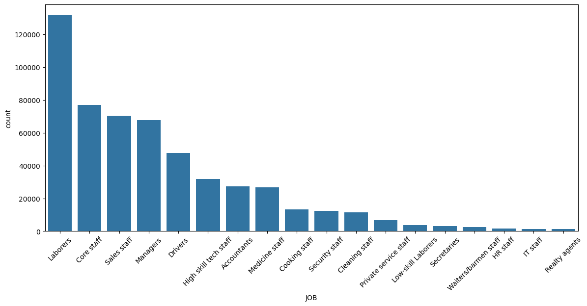
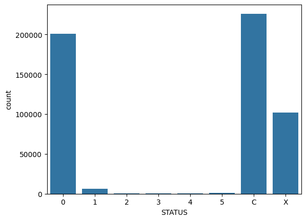
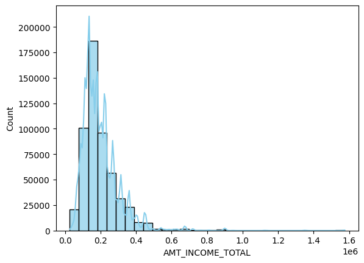
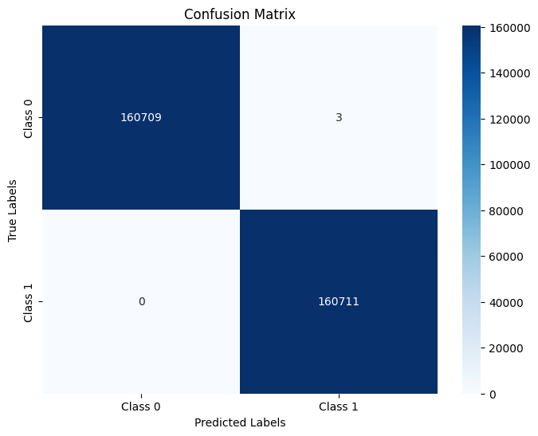
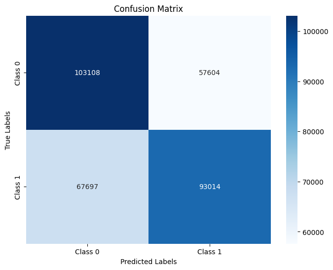
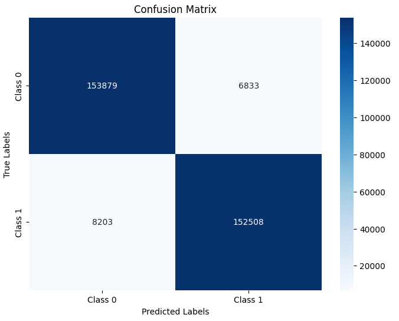

# CSE 151A Group Project 

## Download the dataset
The dataset is available at [Kaggle](https://www.kaggle.com/datasets/laotse/credit-card-approval). You can download the dataset by clicking the download button on the right side of the page. For our project, we have saved the dataset as `credit_card_approval.csv`.

## Environment Requirement
We use the default environment of Google Colab, which is defined in `requirements.txt`

## Introduction
In this project, we tried to tackle the task of predicting credit card approvals using a variety of machine learning models. We chose this project because of the challenging credit card approval process, giving our project real-world applications in the finance industry. Credit card approvals involve evaluating all aspects of an applicant’s personal finance, and a good predictive model can help automate and streamline this process, reducing time and cost for institutions. In this project, we work with a dataset that mirrors a real-world application while also not containing any protected attributes, allowing us to build a model free of biases towards any particular group of people. We deployed techniques in data preprocessing, feature engineering, and model evaluation to ensure we build an effective and robust model. Some of the major challenges we encountered is handling class imbalance and diverse feature, tackling these problem made it a chance to explore advanced techniques, thus creating a valuable learning experience for all of us.

Our focus is to build a robust predictive model for credit card approvals. It allows financial institutions to make consistent, data-driven decisions, reducing the likelihood of human errors or subjective biases. We hope to improve accessibility by enabling quicker approvals for applicants who meet the criteria, fostering financial inclusion. Conversely, identifying potential risks accurately helps institutions maintain their financial stability, ultimately benefiting both the consumers and the financial ecosystem. In this project, we aim to investigate how various machine learning models perform in predicting credit card approvals, evaluate and resolve the limitations of the dataset. Through this work, we hope to highlight the critical role of representative data and thoughtful model design in achieving equitable and reliable outcomes in financial applications.

## Methods Section

### Exploratory Data Analysis
The code can be found in the [data_exploration.ipynb](data_exploration.ipynb) notebook.
#### Missing Value
When exploring the dataset, we first looked into the missing entries for each feature, in which we found none. 

#### Feature-wise Distribution
Then we looked at the unique values of each feature and explored each of their distributions respectively. Looking at the unique values and distributions of the different features will inform and guide us for our next steps when we preprocess the data from model training.
Some of the distributions we have looked at:

Distribution of the different jobs

Distribution of the different STATUS:

Distribution of the different income:

### Preprocessing
The code can be found in the [preprocess.ipynb](preprocess.ipynb) notebook.
#### Missing Values
We found no missing values in the dataset, eliminating the need for imputation or removal.
#### Categorical Data Encoding
For variables like `CODE_GENDER`, `FLAG_OWN_CAR`, and `FLAG_OWN_REALTY`, binary encoding was applied. Features with inherent ordinal relationships, such as `NAME_EDUCATION_TYPE`, were ordinally encoded (e.g., higher education levels received larger numerical values). Features like `NAME_FAMILY_STATUS`, `NAME_HOUSING_TYPE`, and `JOB` were one-hot encoded to capture non-ordinal relationships. For JOB, less frequent categories were grouped as "Other" to reduce model complexity.
#### Quantitative Data Transformation
Continuous variables like `AMT_INCOME_TOTAL`, `DAYS_BIRTH`, and `BEGIN_MONTHS` were standardized using either StandardScaler or MinMaxScaler, depending on their distributions. Also, we evaluated the effect of outliers on `AMT_INCOME_TOTAL` and other features, standardizing them to minimize their influence on the model while preserving all data points.
#### Feature Selection:
We removed the feature `FLAG_MOBIL` because it was constant across all rows, providing no predictive value.
#### Target Variable:
To address the class imbalance in the variable `Target`, we experimented with RandomOverSampler to create a balanced `Target` dataset.
### Model 1: Logistcal regression
The code can be found in the [model1.ipynb](model1.ipynb) notebook.
For our first model, we utilized logistic regression due to its simplicity, interpretability, and effectiveness in binary classification problems such as predicting credit card approvals. Logistic regression models the probability of an applicant being approved or rejected based on the provided features by fitting a logistic function to the dataset.
We trained the logistic regression model on the preprocessed dataset after applying feature encoding, scaling, and handling class imbalance through stratified splitting. The target variable, TARGET, was used to classify applicants into two categories: approved or rejected. To ensure robust evaluation, we implemented k-fold cross-validation and monitored metrics such as accuracy, precision, recall, and F1-score to measure performance.
### Model 2: XGBoost Classifier
For the second model, we used the XGBoost Classifier, a powerful ensemble learning algorithm known for its ability to handle complex data patterns and imbalanced datasets effectively. XGBoost is particularly suitable for binary classification problems and allows fine-tuning of hyperparameters to achieve optimal performance.
#### Model 2.1: XGBoost Classifier with imbalanced dataset
The code can be found in the [model2_1.ipynb](model2_1.ipynb) notebook.
When dealing with imbalanced dataset, we tried to utilizing the `scale_pos_weight` parameter to assign greater weight to the minority class, ensuring the model accounts for class imbalance during training. In addition, we employed GridSearchCV to fine-tune the model's hyperparameters, including n_estimators, learning_rate, max_depth, min_child_weight, and gamma. Lastly, cross-validation was used to ensure that the tuned hyperparameters generalized well across different data splits.
#### Model 2.2: XGBoost Classifier with balanced dataset
The code can be found in the [model2_2.ipynb](model2_2.ipynb) notebook.
To address the class imbalance in the dataset, we applied RandomOverSampler to create a balanced dataset where the minority class (TARGET = 1) was oversampled to match the majority class (TARGET = 0). The balanced dataset was then used to train the XGBoost Classifier to evaluate how balancing the data impacts model performance and predictive power. Then, we followed the same steps as previous XGBosst training by running GridSearchCV to optimize key hyperparameters for the balanced dataset. This GirdSearchCV also includes n_estimators, learning_rate, max_depth, min_child_weight, and gamma. We also applied cross-validation to ensure the model’s generalization ability to unseen data
### Feature Investigation: Investigating Dominant Features by Removing  `Status`
The code can be found in the [model2_feature.ipynb](model2_feature.ipynb) notebook.
The motivation for this method stems from the fact that our previous models (logistic regression and XGBoost) achieved near-perfect performance, which raises questions about what drives such results. The detailed performance results will be analyzed in the next section. Through this method, we aim to investigate the underlying cause of this perfection by identifying and analyzing the most influential features in the dataset.
To achieve this, we calculated the correlation between each feature and the target variable (TARGET) to rank their importance. We observed that the feature Status had a relatively high correlation of 0.35 with TARGET, suggesting it might have a strong influence on the model's predictions. To test this hypothesis, we removed the feature Status and retrained both the logistic regression model and the XGBoost Classifier (with imbalanced and balanced datasets). For the XGBoost models, we re-optimized the hyperparameters using GridSearchCV to ensure the models performed optimally without the influence of the removed feature. By comparing the performance of these updated models to the original ones, we aim to determine whether the dominance of the Status feature was a contributing factor to the perfect performance observed earlier

## Results Section

For model1, the training metrics indicate exceptional performance. The model achieves 100% training accuracy, along with near-perfect precision, recall, and F1-scores across all classes. The confusion matrix further supports these results, showing only eight misclassifications in the majority class and none in the minority class. 

The second model also achieves perfect performance, with 100% accuracy, precision, recall, and F1-scores on both the training and test datasets. The confusion matrix confirms no misclassifications, demonstrating flawless generalization and error-free predictions across all classes. 

After we removed the `Status` feature, the logistic regression model achieves an accuracy of 61.06%, with moderate precision, recall, and F1-scores for both classes. Class 0 has a slightly better recall (64%) compared to class 1 (58%), while class 1 has marginally better precision (62% vs. 60%). The confusion matrix highlights significant misclassifications in both classes, indicating room for improvement in the model's ability to generalize.

Similarly, the XGBoost Classifier demonstrates a strong performance with a training error of 4.62% and a test error of 4.68%, indicating consistent generalization between training and testing. It achieves 95% accuracy, precision, recall, and F1-scores across both classes. The confusion matrix shows that most predictions are correct, with a small number of misclassifications: 6,833 for class 0 and 8,203 for class 1. Overall, the model performs well but has slight room for improvement in reducing errors.

## Discussion Section

Upon finishing our exploratory data analysis, we gained an initial understanding of our dataset. It appears that most of the features in the dataset are different types of categorical data with only a handful of exceptions such as the anual income and days employed. Given that the dataset is already free of missing values, we did not do any form of imputation or removal of the data. For binaray categorical data such as  `FLAG_OWN_CAR`, and `FLAG_OWN_REALTY`, we performed binary encoding turning strings into `1`s and `0`s so it could be better interpreted by the models that we will build later. On the other hand, we performed ordinal encoding on features such as `NAME_EDUCATION_TYPE` to preserve the ordinal relationships between the different values in these features. It is important to preserve this relationship because this could be important in revealing the underlying pattern in credit card approvals. Next we performed one-hot encoding on multi-class categorical features that don't have a ordinal relationship. It is worth noting here that for `JOB ` feature specifically, we aggregated the less frequently occuring values into a `Other` value of the feature to reduce the complexity of our model to prevent overfitting. 

As for quantitative features, we standardized each of them because they are had drastically different ranges. For example, while the anual income feature contained value that goes up all the way to 1.57 million, days of employment only goes up to 17. Depending on the different distributions that the feature had, we deployed either standardization or min-max normalization. For example, for feature such as anual income that contains outliers, we deployed standardization.

In general, we preserved most of the features for our models with only one exception. We chose to remove the feature `FLAG_MOBIL` about whether the credit card applicant has a mobile phone because it is constant across all observations, providing no insight into our task.

One  issue we noticed in or exploratory data analysis step and the preprocessing step is the imbalance in the variable that we are trying to predict, `Target`. To alliviate this problem, we made sure that we stratified the data when spliting train/test sets and used `RandomOverSampler` to create a balanced dataset.

For the first model we built, we chose logistic regression because it was simple and interpretably. We wanted to use it to see how the dataset performs with the most basic model for binary classification problem. We trained it using training dataset with all of the features other than `FLAG_MOBIL` after proper feature engineering. In the process, we used k-fold cross-validation to monitor metrics such as accuracy, precision, recall, and the F1 score and ensure the robustness of our model. To our surprise, the most basic logistic regression model performed extremely well, having 100% training and testing accuracy with neawr perfect precision, recall, and F1 score across both classes. The moment we saw the results, we knew there must be something wrong. Since we have already used stratification when dividing our train and test sets, the first hypothesis we ruled out was the high performance coming from a poorly divided dataset. In this case, we were suspecting that because the test set does not contain any negative cases, the 100% accuracy could've just been achieved by only predicting true. 

Afterwards, the second model we tried was XGBoost Classifier. This is an extremely powerful ensemble learning algorithm that is know for handling complex data patterns and imbalanced datasets. We chose this one as our second model because we were curious if the basic model is already performing so well, how would a state-of-the-art model perform. When we used this model, we took two different approaches when dealing with the imbalanced dataset that we have. The first being using the `scale_pos_weight` parameter to assign greater weight to the minority class to ensure the model to account for class imbalance during the training process. After using grid search to finetune the model's hyperparameters, we got the result similar to the performance of our first model. Just like the logistic regression, our XGBoost Classifier also performed perfectly. This time, all of the predictions came back to be correct. Then we used a different method to handle the imbalanced dataset. The other approach we used is to use `RandomOverSampler` to create a balanced dataset to populate the minority class to match the majority class. Then we used the same process to train the XGBoost Classifier using grid search to find the best hyperparameters for the balanced dataset. In the end, this model also performed perfectly predicting every observation correctly. 

In the end, after discussing with the TA of the course, we realized that we overlooked one important aspect, which is if a feature could perfectly predict the outcome. Previously, when we saw our results for the first model, we thought of this possibility but from a different perspective. At that time, we investigated if any of the features is a perfect predictor by looking at if any feature had the same distribution as the thing that we are trying to predict. We were not able to find anything during our investigation. After talking with the TA, we resumed our investigations and found out that one feature highly correlated with what we tried to predict. The feature that we found was the `STATUS` feature with a high correlation of 0.35 with `TARGET`. To test our hypothesis, we removed the feature from our model and retrained both models. In the end, we got significantly lower accuracy for the our baseline model and lowered performence in the XGBoost classifier. The result of our investigation reveals that the high performance of our model mostly come from the `STATUS` feature alone. 

## Conclusion
In the end, we were able to identify a feature that is very important to credit card approval, `STATUS`. After our investigation, it is proven that this is indeed a feature that is obtainable before the credit card approval process is determined. Therefore, we were able to build models that can effectively predict credit card application outcomes. In the meantime, it is also a very fruitful learning experience. In the process of working with this dataset on this task, we were able to learn about how to handle imbalanced data and investigate the cause of the performance of our model. In the future, we would like to also explore how we can develop a good model for predicting credit card approval without the `STATUS` feature. 

## Statement of Collaboration

Bobby: I actively contributed to the project by participating in discussions to select an appropriate dataset, ultimately proposing the dataset that the team finalized. For data preparation, I conducted exploratory data analysis (EDA) for one-third of the features to ensure the absence of missing values and visualized the data using various plots, such as pairplots and boxplots, to gain a deeper understanding of the data's characteristics. I also examined the correlations between features and excluded highly correlated ones to mitigate potential collinearity issues. I played an active role in group discussions on addressing the imbalanced nature of the dataset. During the meeting, I proposed oversampling the minority class and using an XGBoost model to handle the imbalance. I then implemented the XGBoost model and leveraged the scale_pos_weight parameter to address the class imbalance effectively. After establishing this baseline model, I utilized GridSearchCV to fine-tune the hyperparameters, including n_estimators, learning_rate, max_depth, min_child_weight, and gamma, to optimize the model's performance. For the project report, I drafted the overall framework and contributed to writing the introduction, preprocessing, and methodology sections, ensuring the report's clarity and cohesiveness.

Jessie: I actively participated in discussions on dataset selection and conducted part of the feature analysis and feature encoding process before integrating the data into the model. To address the data imbalance issue in our dataset, I implemented the RandomOverSampler method and re-ran the model using the balanced dataset.
During analysis, I discovered that the model's performance was overly optimized when including all features, primarily due to the dominant influence of the "STATUS" feature. I conducted tests that demonstrated the model could achieve nearly 100% prediction accuracy using only the "STATUS" feature. However, with it, the linear regression model performed better. To improve performance without relying on the "STATUS" feature, I transitioned to using the XGBoost Classifier, achieving a 95% accuracy rate even without including "STATUS." Finally, I enhanced the report by including confusion matrix visualizations to provide a clearer understanding of the model's performance and classification outcomes. 

Jiesen: I also activevly participated in the discussions on the dataset selection and proposed the dataset that we ended up using. I did the exploratory data analysis on half of the features of the dataset, also performing data engineering on them. On the problem of imbalanced dataset, I proposed different possible causes of the issue and proposed different potential solutions to the issue. Later on of the project, I took on the role of the writer. I refined all of the reports since Milestone2, while writing discussion and conclusion for each of them. For the final report, I wrote the EDA section of the methods, the entirety of the discussion section, and the conclusion section. 

Will: I actively contributed to discussions on dataset selection, data exploration, preprocessing, and the development of our models (Model 1 and Model 2). For my portion of the project’s features, I applied one-hot encoding, standardization, and created visualizations such as pairplots and boxplots. Additionally, I proposed and implemented logistic regression as our initial model and addressed data imbalance by incorporating the stratify parameter. Beyond the technical work, I assisted in drafting earlier milestone documents, contributed to writing the result section of the final report, and refined the report for overall consistency and clarity. Throughout the project, I collaborated with the team to manage the project timeline, ensuring that we met all our deadlines and milestones. I also oversaw version control on GitHub, resolved merge conflicts, and handled other logistical tasks. By coordinating team efforts and clarifying individual responsibilities, I helped maintain an effective and cohesive working environment.
